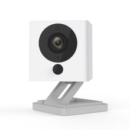
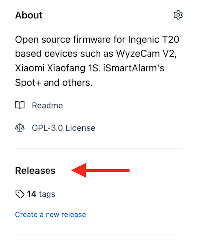
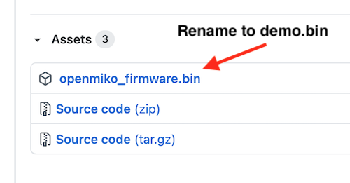
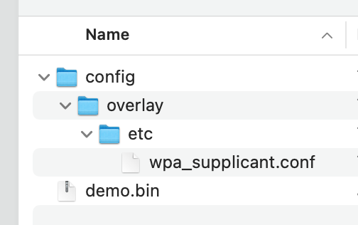

# OpenMiko

OpenMiko is custom opensource firmware for cameras that use the Ingenic T20 chip.
These cameras include the Wyzecam V2 and Xiaomi Xiaofang.

The firmware aims to provide an an alternative to the closed source out of box firmwares which can often be riddled with bugs and security holes. Privacy is also a concern as it is difficult to tell if out of box firmware reaches out to other servers or is broadcasting metadata.

## Features

- No app to download
- Support for common protocols such as RTSP and MJPEG
- SSH server
- ffmpeg
- mjpg-streamer
- Easily add or compile your own applications
- Supported by OctoPrint (https://community.octoprint.org/t/wyze-cam-v2-and-octoprint-as-of-28dec2020/27081)

## Differences between this project and DaFang Hacks / OpenFang

This project is focused on providing a better foundation for developers and end users.
At the time of this project OpenFang was relatively quiet. DaFang Hacks has some activity
but I felt the way it was made was not necesssarily conducive to developing on a solid platform.

This project generously uses the code from both projects and it is much appreciated.

A few of the quality of life improvements in this project aimed at developers:

- A standardized toolchain based on [Buildroot](https://buildroot.org/)
- Docker image for development with precompiled artifacts available for download
- A compiled `uboot` based bootloader with USB ethernet and ext4. Load kernel images (`uImage.lzma`)
via TFTP for faster development.


## For end users

This firmware is a drop in replacement for the stock firmware. Care has been taken to ensure the firmware is compatible with the current flashing methods available. This means there is no need to rewrite the bootloader and that future firmware releases from the original manufacturer should continue to work.

For help join our Slack Channel:

https://join.slack.com/t/openmiko/shared_invite/zt-mkz7i6xu-_gL4ZShWdVT08AJobe1PqQ


## Overview

At the present time, this repository only contains kernel and rootfs for cameras using Inegnic T20 SOC. To ease identifying these cameras please use the pictures below. A more detailed technical description can be found [here](doc/overview.md).

Ingenic T20X (128Mb DDR) | &nbsp;
:-- | --:
 Wyze Cam V2 | 
 Xiaomi Dafang |  Wyze Cam Pan

If you have a device with a Ingenic T10 SOC, consider using for now https://github.com/EliasKotlyar/Xiaomi-Dafang-Hacks

If you have a classic XiaoFang with a ARM-Processor, consider using https://github.com/samtap/fang-hacks

## Installation and Usage

Before installing OpenMiko, we suggest you carefully read the [FAQ](/doc/faq.md).

Download the specific version of the firmware you wish to install. The releases can be found on the right hand side in Github under the label "Releases".

[](https://github.com/openmiko/openmiko/releases)

Rename the firmware to `demo.bin` and put it in on the root of the microSD card.

[](https://github.com/openmiko/openmiko/releases)


Power off the camera and insert the microSD card.

Hold the setup button, plug in your USB cable, keep holding the setup button for 1-2 seconds until the light is solid blue, then release the button.

After about 30 seconds you should get a flashing yellow LED which indicates the camera is working.


## Setting up the wifi

Wifi configuration is done via the sdcard.

On the sdcard create the directories `/config/overlay/etc`:



In the `etc` directory copy the file [`wpa_supplicant.conf`](https://github.com/openmiko/openmiko/blob/master/overlay_minimal/etc/wpa_supplicant.conf). Edit this file and plug in your wifi name and password.

Insert the sdcard into the camera and reboot. OpenMiko will copy this directory over to the `/config` partition (which is persistent flash storage). This method can also be used to overwrite other files. For example:


- `/etc/passwd` and `/etc/shadow` can be overwritten to make sure password changes are persistent
- `/config/overlay/etc/dropbear/dropbear_ecdsa_host_key` can be used to have a persistent SSH signature

## Usage

The configuration by default provides 3 output streams:

- 1920x1080 H264
- 1920x1080 JPG over HTTP (MJPEG)
- 640x360 H264

There are some jagged edges on the 640x360 stream that I haven't been able to figure out yet.

The streams can be accessed using the following URLs:

- rtsp://IP:8554/video3_unicast
- rtsp://IP:8554/video5_unicast
- http://IP:8080/?action=stream
- http://IP:8080/?action=snapshot


## Settings

Settings can be changed by editing /etc/videocapture_settings.json. However the changes will not persist unless you write them to the flash. To ease saving these settings copy the file to `/config/overlay/etc/videocapture_settings.json`. The files in /config are mounted to the flash chip and will survive reboots.


### Writing Config Files

On boot it is possible to put files on the sdcard and have them copied permanently to the configuration storage area of the camera.

You should create a directory called `config` on the sdcard.

Inside this directory create more directories. In particular create `/config/overlay/etc` and any files you want to write to the camera. For example to change the wifi module that is loaded create a file `<SDCARD>/config/overlay/etc/openmiko.conf`.

In `openmiko.conf` copy the default one from https://github.com/openmiko/openmiko/blob/master/overlay_minimal/etc/openmiko.conf and change the line that says `WIFI_MODULE=8189fs` to `WIFI_MODULE=8189es`.


### profile

```
0 - profile Constrained Baseline
1 - profile Main
2 - profile High
```

### Resetting the configuration

While the camera is started hold down reset button for at least 6 seconds.
After 6 seconds the blue LED should turn on and pulse 3 heartbeats. The `/config` partition (which is mounted to the persistent flash memory itself) will be removed.

## Troubleshooting

If you can't seem to get up and running here are some things to check:

- Make sure you are using unix style line endings in wpa_supplicant.conf (this was fixed in a later release)
- Inside wpa_supplicant.conf the `psk` and `ssid` settings need to have double quotes around the string. For example `psk="password_keep_double_quotes"`
- Make sure the file does not have a `.txt` extension. The file should show up as `wpa_supplicant.conf`. `Not wpa_supplicant.conf.txt`
- The `config/overlay/etc` directory is *cAsE sEnsItiVe*. Make sure it is all lowercase.
- The MAC address does change when flashing from the one on the sticker. Check your router to see the new DHCP address.
- There are some reports that assigning a static IP / DHCP reservation does help the WyzeCam connect to the network
- Logs should appear on the sdcard if the system is properly booting
- Some WyzeCams have a buggy bootloader from the factory and won't flash anything. The only way around this is to flash a new bootloader.
- If you flashed the custom HD Dafang bootloader you will need to revert to the original one. A copy of the old WyzeCam V2 original bootloader is here: https://github.com/openmiko/openmiko/blob/master/stock_firmware/wyzecam_v2/wyzecam_v2_stock_bootloader.bin
- Join the Slack and ask a question for more help


## Issues and support

If you encounter an issue which you think is a bug in the OpenMiko or the associated libraries, you are welcome to submit it here on Github: https://github.com/openmiko/openmiko/issues.

Please provide as much context as possible:

- buildroot core version which you are using;
- kernel version and modules you have enable;
- build root packages you are trying to integrate;
- when encountering an issue which happens at run time, attach serial output. Wrap it into a code block, just like the code;
- for issues which happen at compile time, enable verbose compiler output in the buildroot preferences, and attach that output (also inside a code block);
- development board model and brand;
- other settings (board choice, flash size, etc.).


## Contributing

Pull requests are welcome. For fixes of code and documentation, please go ahead and submit a pull request.
