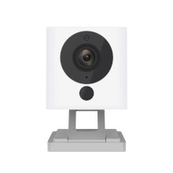

# OpenMiko

OpenMiko is a bootloader, kernel and toolchain for devices using Ingenic T10 and T20 SOC.

## Differences between this project and DaFang Hacks / OpenFang

This project is focused on providing a better foundation for developers and end users.
At the time of this project OpenFang was relatively quiet. DaFang Hacks has some activity
but I felt the way it was made was not necesssarily conducive to developing on a solid platform.

This project generously uses the code from both projects and it is much appreciated.

A few of the quality of life improvements in this project aimed at developers:

- A standardized toolchain based on [Buildroot](https://buildroot.org/). It is based on an older
Buildroot, 2016.02, though due to kernel constraints.
- Docker image for development with precompiled code (the image is big though, greater than 8GB)
- A compiled `uboot` based bootloader with USB ethernet booting and ext4. Load kernel images (`uImage.lzma`)
via TFTP for faster development.


## Overview

At the present time, this repository only contains kernel and rootfs for cameras using Inegnic T20 SOC. To ease identifying these cameras please use the pictures below. A more detailed technical description can be found [here](doc/overview.md).

Ingenic T20L (64Mb DDR) | &nbsp;
:-- | --:
 Xiaomi Mijia 2018 |  Xiaomi Xiaofang 1S

Ingenic T20N (64Mb DDR + SIMD128)
:-- |
 DIGOO DG W30

Ingenic T20X (128Mb DDR) | &nbsp;
:-- | --:
 Wyze Cam V2 | 
 Xiaomi Dafang |  Wyze Cam Pan

If you have a device with a Ingenic T10 SOC, consider using for now https://github.com/EliasKotlyar/Xiaomi-Dafang-Hacks

If you have a classic XiaoFang with a ARM-Processor, consider using https://github.com/samtap/fang-hacks

## Installation and Usage

Before installing OpenMiko, we suggest you carefully read the [FAQ](/doc/faq.md).

<!-- After that, continue to the [Installation](/doc/install.md) procedure. More details on [troubleshooting](doc/troubleshooting.md).
 -->

### 1. Flash the custom bootloader

Flashing the bootloader can be done a number of ways but generally require either a serial connection or existing shell access.


**WARNING - AN ERROR IN THIS STEP WILL BRICK YOUR DEVICE REQUIRING DESOLDERING TO RECOVER**


```
flash_erase /dev/mtd0 0 0
dd if=u-boot-lzo-with-spl.bin of=/dev/mtd0
```


### 2. Prepare a microsd card with the linux root file system


## On Mac OS

You need to use the `diskutility` command line. Format your card using whatever filesystem you want for the first partition and FAT32 for the 2nd partition.

The first partition needs to be at least the size of the rootfs.ext2 file. We will `dd` the image onto the first partition and use the 2nd to store cross OS compatible files such as configuration.


`diskutil partitionDisk disk2 2 mbr exfat rootfs 2G fat32 DATA 0`

After partitioning `diskutil list` should show:

```
/dev/disk2 (internal, physical):
   #:                       TYPE NAME                    SIZE       IDENTIFIER
   0:     FDisk_partition_scheme                        *15.9 GB    disk2
   1:               Windows_NTFS rootfs                  2.0 GB     disk2s1
   2:                 DOS_FAT_32 DATA                    13.9 GB    disk2s2
```

### Overwrite the the rootfs parition with an ext4 image. We use `dd` for this.

`sudo dd if=rootfs.ext2 of=/dev/rdisk2s1 bs=64k`

### Resize rootfs

You may need to eject the disk and then reinsert it again to be able to run this command.
Oterhwise you will get a an error:

`open: Resource busy while opening /dev/disk2s1`

`sudo $(brew --prefix e2fsprogs)/sbin/resize2fs /dev/disk2s1`


## Usage

Openfang is actively developed and releases are only provided when the openfang distribution is stable. If you want to test the development version you can easily compile it using [docker](https://www.docker.com/). More details on how to do it [here](doc/docker.md).

## Issues and support

If you encounter an issue which you think is a bug in the openfang or the associated libraries, you are welcome to submit it here on Github: https://github.com/anmaped/openfang/issues.

Please provide as much context as possible:

- buildroot core version which you are using;
- kernel version and modules you have enable;
- build root packages you are trying to integrate;
- when encountering an issue which happens at run time, attach serial output. Wrap it into a code block, just like the code;
- for issues which happen at compile time, enable verbose compiler output in the buildroot preferences, and attach that output (also inside a code block);
- development board model and brand;
- other settings (board choice, flash size, etc.).


## Contributing

Pull requests are welcome. For fixes of code and documentation, please go ahead and submit a pull request.

## License and Credits

This project is fork of https://github.com/anmaped/openfang/ which was no longer being actively
maintained.

Buildroot is developed and maintained by The Buildroot developers.
