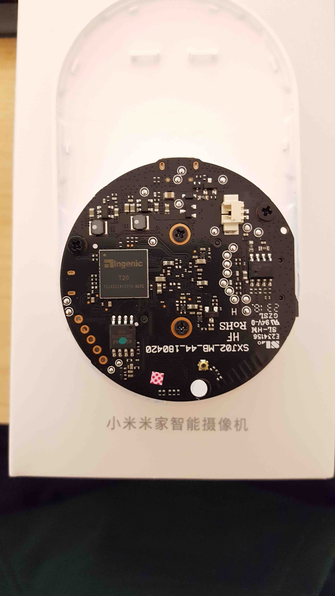
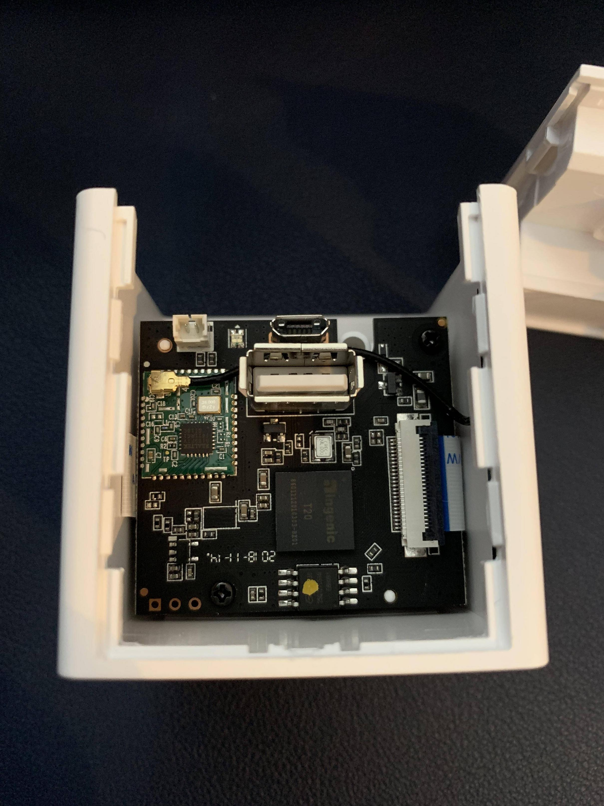

# Overview

This document attempts to merge all information as a technical description.

| Camera             | ID       | Picture                                   | SOC  |Wireless    | iSensor   | FLASH      | GPIO                                                  | Notes                  |
|--------------------|----------|-------------------------------------------|------|------------|-----------|------------|-------------------------------------------------------|------------------------|
| Xiaomi Mijia 2018  | SXJ02ZM  |       | T20L | 8189FTV    | ps5250    | W25Q128    | b_led_pin 76; y_led_pin 75; ir_pin 72;                | motor:false; usb:false |
| Xiaomi Xiaofang 1S | SENISC5  |     | T20L | 8189FTV    | jxf23     | EN25QH128A | usb_en_pin 77; b_led_pin 39; y_led_pin 38; ir_pin 49; | motor:false; usb:true  |
| Xiaomi Dafang      | DF3      |  | T20X | 8189ETV    | jxf22     | GD25Q128   | usb_en_pin 77; b_led_pin 39; y_led_pin 38; ir_pin 49; | motor:true;  usb:true  |
| Wyze Cam V2        | WYZEC2   |            | T20X | 8189FTV    |           |            | usb_en_pin 77; b_led_pin 39; y_led_pin 38; ir_pin 49; | motor:false; usb:true  |
| Wyze Cam Pan       | WYZECP1  |                                           | T20X | 8189ETV    |           |            | usb_en_pin 77; b_led_pin 39; y_led_pin 38; ir_pin 49; | motor:true;  usb:true  |
